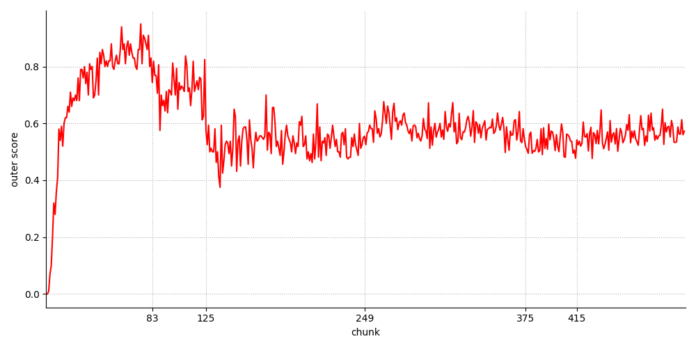

# Open World Data Stream Generator with Concept Non-stationarity

The `OWDSG` is a non-stationary data stream generator combining the concept drift and novel class ocurrence. The generator can be used to prepare experiments in the task of *concept drift detection*, *novely detection* and *open set recognition*. The base sample distrubutions are genrated using *Madelon* generator evaliable in `scikit-learn` and transformed into a data stream.


## Quick start guide

The stream is generated by initializing the OWDSG object:
```
stream = OWDSG(n_drifts = 2, 
        n_novel = 3, 
        n_classes = 2,
        n_chunks = 500, 
        chunk_size = 100, 
        percentage_novel = 0.2,
        hide_label = False,
        weights = [0.25,0.75])
```

The data chunk `i` can be obtained with:
```
X, y = stream.get_chunk(i)
```

The concept drift and novelty ground truth, indicating the chunk indexes in which the events occur, can be obtained with:
```
stream.get_drift_gt()
stream.get_novel_gt()
```

The simple experiment presenting the use of data stream in Open Set Recognition task is available in `example.py' file. The generated data strea was used to estimate the ability of the MLP classifier to distinguish between known classes (KC) and novel, unknown objects (UC). the results of the *outer score* for this exemplary experiment are presented below.


